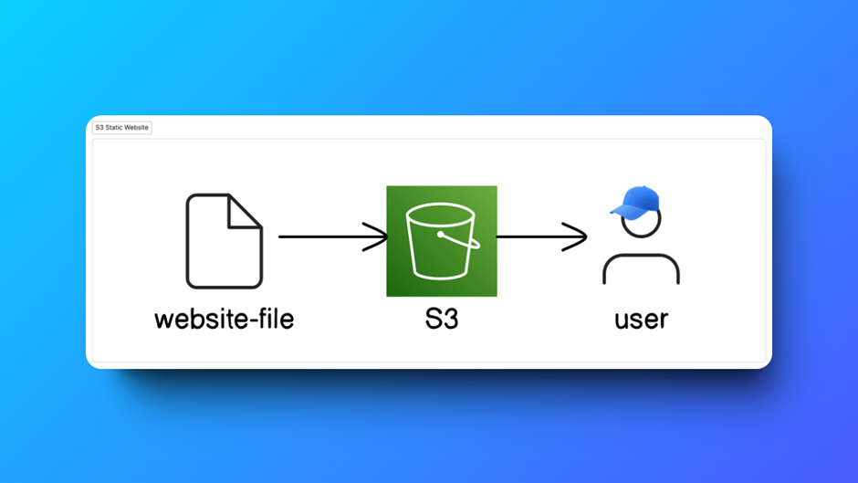
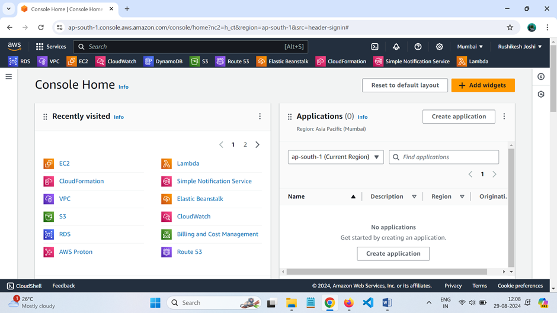
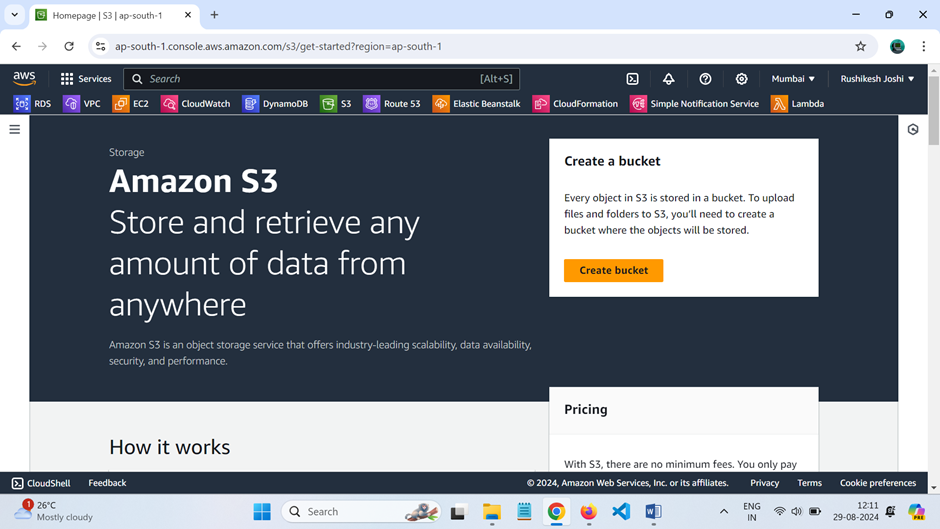
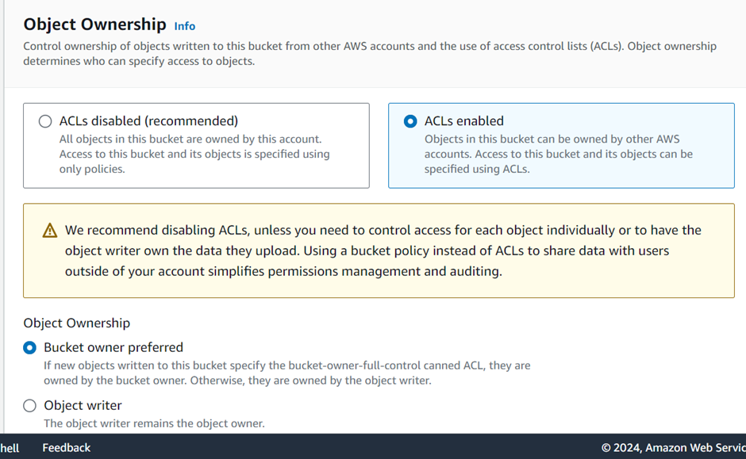
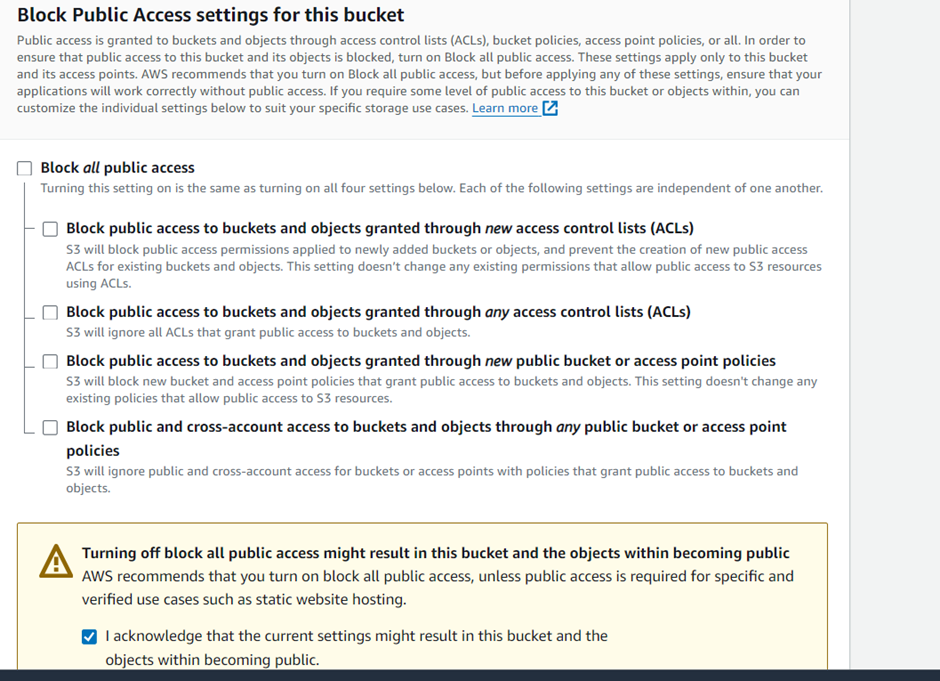
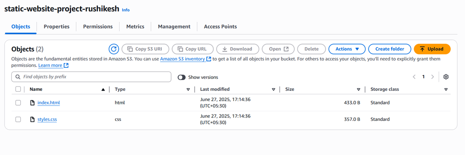
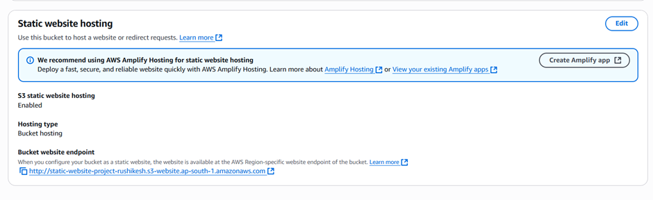
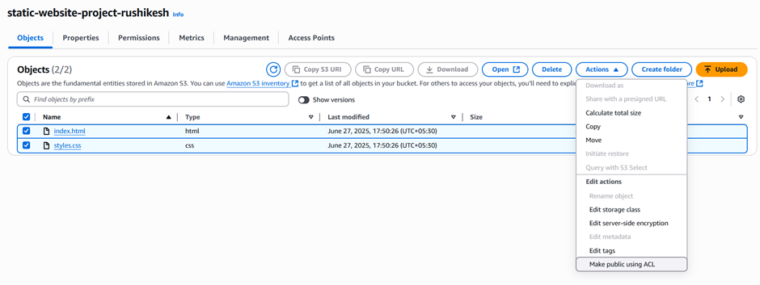
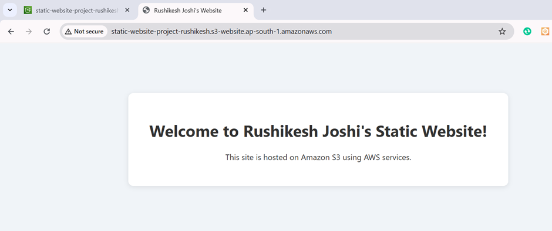

# Host a Website on Amazon S3

You can use Amazon S3 to store and retrieve any amount of data at any time from anywhere on the web. This guide walks through how to host a static website using Amazon S3.

---

## Step 1: Login to AWS Console

Select your closest region (e.g., Mumbai).

---

## Step 2: Create an S3 Bucket

Search for **S3** in the AWS Management Console and create a bucket.

### Bucket Settings:

- Name: `static-website-project-rushikesh`
- Enable **ACLs**
- Choose **Bucket owner preferred**

### Disable Block Public Access

Uncheck **Block all public access**.

---

## Step 3: Upload Website Files

Go to your bucket and upload `index.html` and `styles.css`.

---

## Step 4: Enable Static Website Hosting

Go to **Properties** and enable static website hosting. Set the index document to `index.html`.

---

## Step 5: Make Objects Public

Use **Actions → Make public using ACL** to make the files accessible.

---

## Final Result

Your static site is now live!

---

## Cleanup

Delete your S3 bucket and its contents when you're done to avoid incurring charges.

---

📸 Remember to take screenshots of your steps if required.
